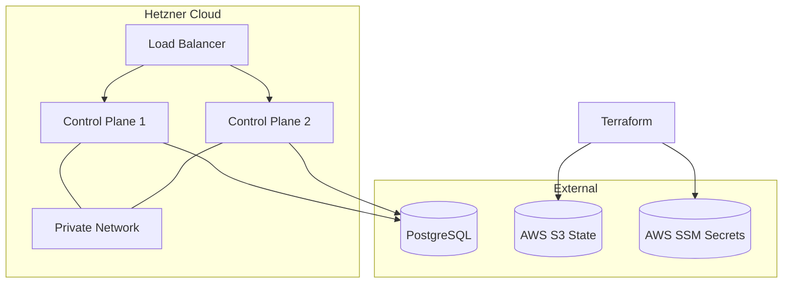

# k3s-nebula

> **Highly Available k3s on Hetzner Cloud with Terraform & GitOps**


**k3s-nebula** is a production-ready infrastructure stack for deploying a fault-tolerant k3s cluster on Hetzner Cloud. It is designed for simplicity, cost-effectiveness, and GitOps-native workflows.

**Maintained by [WebTree](https://webtree.org)**

## 🚀 Features

- **High Availability**: Multi-control plane setup with HAProxy load balancing
- **Cost Effective**: Runs on Hetzner Cloud (starting ~€20/mo for HA)
- **GitOps Ready**: Pre-configured with ArgoCD for declarative management
- **Secure**:
  - Private networking for all nodes
  - OIDC authentication via Keycloak
  - Automatic TLS with Let's Encrypt & Traefik
  - SSH keys & secrets managed via AWS SSM
- **Modular**: Split into `infrastructure` (hardware) and `configuration` (k8s resources)

## 🏗 Architecture



## 🛠 Quick Start

### Prerequisites
- Terraform >= 1.5.0
- AWS Account (for S3 state & SSM secrets)
- Hetzner Cloud Account
- Domain name managed via AWS Route53

### 1. Initialize Infrastructure

Create a `terraform.tfvars` file in `cluster-infrastructure`:

```hcl
env             = "prod"
cluster_name    = "my-cluster"
hcloud_token_ssm_path = "/hetzner/token"
ssh_public_keys = ["ssh-ed25519 AAA..."]
# ... other required variables
```

Deploy:
```bash
cd cluster-infrastructure
terraform init
terraform apply
```

### 2. Configure Cluster

Create a `terraform.tfvars` file in `cluster-configuration`:

```hcl
base_domain = "example.com"
argocd_domain = "argocd.example.com"
# ... other required variables
```

Deploy:
```bash
cd cluster-configuration
terraform init
terraform apply
```

## 📖 Documentation

- [Operations Guide](OPERATIONS.md): Day-2 operations, upgrades, and maintenance
- [Developer Guide](DEVELOPER.md): How to extend and contribute
- [Troubleshooting](TROUBLESHOOTING.md): Common issues and fixes

## 🤝 Contributing

We welcome contributions! Please see [CONTRIBUTING.md](CONTRIBUTING.md) for guidelines.

## 📄 License

This project is licensed under the GNU Affero General Public License v3.0 (AGPL-3.0) - see the [LICENSE](LICENSE) file for details.
